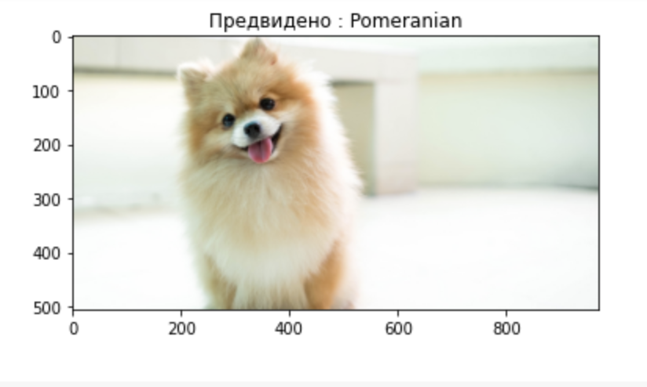

[//]: # (Image References)


[image1]: https://img.youtube.com/vi/GR8-EztBI9I/0.jpg "Video1"
[image2]: https://img.youtube.com/vi/GR8-EztBI9I/0.jpg "Video2"
[image3]: https://img.youtube.com/vi/GR8-EztBI9I/0.jpg "Video3"


# DogBreedClassifier
Dog Breed Classifier implementation in Keras
Овде пишуваме некој опис на проектот
---

| Video1      | Vide2 | Video3 |
| ----------- | ----------- | ----------- |
| [![image1]](https://www.youtube.com/watch?v=GR8-EztBI9I)   | [![image2]](https://www.youtube.com/watch?v=GR8-EztBI9I)    | [![image3]](https://www.youtube.com/watch?v=GR8-EztBI9I)      |


**Пример болд текст** primer tekst.   
*Primer italic текст* primer tekst 2


> Овој проект беше изработен од страна на учениците на Data Science Academy


Ова беше наставната програма по Невронски мрежи :

1. Feed forward Neural Networks.  
  1.1 Backpropagation  
  1.2 Gradient Descend 
2. Convolutional Neural Networks
3. Recurrent neural networks


Учесниците ги направија следните проекти :

* Dog Breed Classifier
* Denoising images with autoencoders
* Cifar10 Image classification

Our proposed neural network architecture for solving Dog Breed Classifier : 

```
model = Sequential()

model = ResNet50(include_top=False, input_shape=(224,224,3), weights='imagenet')

#layer = model.get_layer('conv3_block1_1_conv')

av_pool = GlobalAveragePooling2D()(model.output)
class1 = Dense(490, activation='relu')(av_pool)
normaliz = BatchNormalization()(class1)
class2 = Dense(520, activation='relu')(normaliz)
normaliz1 = BatchNormalization()(class2)
outputs = Dense(133, activation='softmax')(normaliz1)

model = Model(inputs=model.inputs, outputs=outputs)

model.summary()
```


За повеќе информации посете ја [Aкадемијата](https://datascience.brainster.co/?utm_source=brainster.co&utm_medium=academies&utm_campaign=website&utm_content=data_science)




| Точност на Training      | Точност на тест | Точност на валидација |
| ----------- | ----------- | ----------- |
| 90%      | 87%       |87%       |


На Академијата за Data Science ќе се стекнеш со клучните дисциплини во  оваа област како.

* Познавање и користење Python
* Business Intelligence
* Статистика
* Интеграција на SQL, Data Warehouse, Power BI и Excel
* Machine Learning и предиктивни модели
 

~~Git doesn't provide footnote support anymore~~ 

Научивме како да кодираме : 
- [x] Python
- [x] SVM
- [x] PCA
- [x] Kmeans
- [x] Neural Networks
- [ ] GANS


